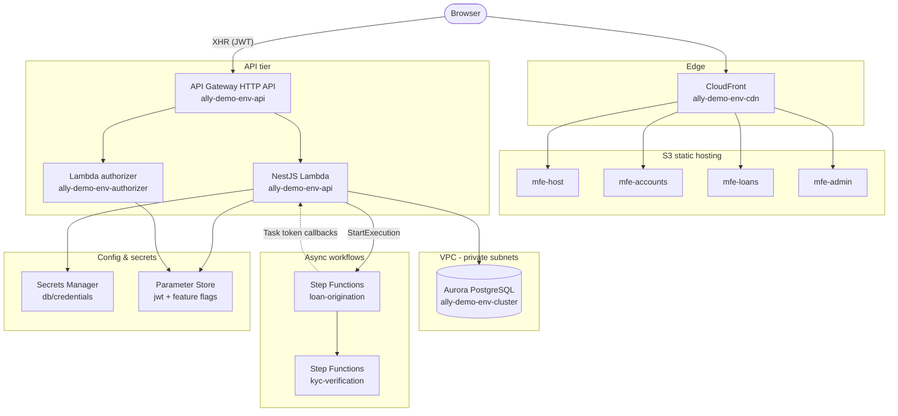

# Architecture

The deployed architecture of ally-demo. All resources follow the naming
convention `ally-demo-<env>-<resource>` (e.g. `ally-demo-dev-api`), where `<env>`
is `dev`, `staging`, or `prod`. Replace the account/region placeholders below
with real values after the first `terraform apply` (the exact ARNs are printed
as Terraform outputs — see `docs/deployment.md`).

## System overview

## Frontend

Four Next.js 14 (App Router) apps hosted on S3 behind a single CloudFront
distribution. CloudFront serves the host shell at `/` and each remote under its
path prefix (`/accounts`, `/loans`, `/admin`).

| App | Bucket | Role |
|-----|--------|------|
| `apps/web-host` | `ally-demo-<env>-mfe-host` | Host shell — auth, nav, Redux store, Module Federation host |
| `apps/web-accounts` | `ally-demo-<env>-mfe-accounts` | Account balances + transfer wizard |
| `apps/web-loans` | `ally-demo-<env>-mfe-loans` | Loan origination wizard + status tracker |
| `apps/web-admin` | `ally-demo-<env>-mfe-admin` | RBAC-gated support/admin portal |

Module Federation is opt-in (`ENABLE_MODULE_FEDERATION=true`); by default each
app builds and runs standalone with the App Router.

## Backend

- **`ally-demo-<env>-api`** — a single NestJS Lambda (via `@vendia/serverless-express`) fronting **all** domain modules (`auth`, `users`, `accounts`, `payments`, `loans`, `admin`). Runtime `nodejs22.x`, deployed in private VPC subnets. Handler: `dist/handler.handler`.
- **`ally-demo-<env>-authorizer`** — API Gateway REQUEST Lambda authorizer that verifies JWTs at the edge (handler: `dist/authorizer.handler`). Returns 401 when the Authorization header is absent, 403 when the token is invalid/expired.
- **API Gateway HTTP API** — public routes `POST /auth/login`, `POST /auth/refresh`; all other routes (`ANY /{proxy+}`) require the authorizer.

## Data store

- **Aurora PostgreSQL Serverless v2** (`ally-demo-<env>-cluster`, engine 16), private subnets only, `storage_encrypted = true`, `rds.force_ssl = 1`.
- Credentials in **Secrets Manager** at `ally-demo-<env>/db/credentials`.
- TypeORM entities: `users`, `accounts`, `transactions`, `payments`, `loan_applications`. `synchronize` is enabled outside production.

## Async workflows

- **`ally-demo-<env>-loan-origination`** — validate → KYC → credit check → underwrite → decision. Uses `waitForTaskToken` for human/async steps.
- **`ally-demo-<env>-kyc-verification`** — document upload → OCR → identity match → sanctions screening.

The NestJS Lambda starts executions (`StartExecutionCommand`) and later resumes
paused states with `SendTaskSuccessCommand` / `SendTaskFailureCommand`. See
`workflows/step-functions/README.md` for full state diagrams and
`docs/loan-origination-walkthrough.md` for an end-to-end trace.

## Configuration & secrets

| Path | Store | Contents |
|------|-------|----------|
| `ally-demo-<env>/db/credentials` | Secrets Manager | Aurora username/password/connection URL |
| `/ally-demo/<env>/jwt-secret`, `/ally-demo/<env>/jwt-refresh-secret` | Parameter Store (SecureString) | JWT signing keys |
| `/ally-demo/<env>/feature-flags/*` | Parameter Store (String) | `loan-origination`, `ach-payments`, `wire-transfers`, `admin-portal` |

## Infrastructure modules

Defined under `infra/` (see `docs/deployment.md`):

| Module | Creates |
|--------|---------|
| `networking` | VPC, public/private subnets (2 AZs), NAT, route tables, VPC endpoints (S3, Secrets Manager, SSM, Step Functions), security groups |
| `iam` | Lambda execution role, Step Functions execution role (least-privilege, ARN-scoped) |
| `database` | Aurora Serverless v2 cluster, parameter group, Secrets Manager secret, CW alarms |
| `lambda` | `api` + `authorizer` functions, log groups, error/throttle/duration alarms, Logs Insights saved queries |
| `api-gateway` | HTTP API, JWT authorizer, routes, access logging, alarms |
| `step-functions` | Both state machines (via `templatefile()`), IAM, logging, X-Ray |
| `cdn` | Per-app S3 buckets + artifact bucket, CloudFront with OAC, SPA rewrite function |
