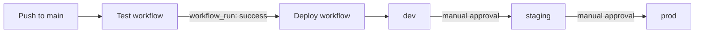

# Deployment

## Prerequisites

- **Node.js ≥ 22.13** and **pnpm ≥ 9** (repo pins `pnpm@11.18.0`)
- **Terraform ≥ 1.7**
- **AWS CLI** configured with credentials for the target account
- **Docker** (local Postgres only)

## Local development

```bash
pnpm install                      # install all workspaces from the root
pnpm db:up                        # start local Postgres (Docker)
cp apps/api/.env.example apps/api/.env
pnpm dev                          # run API + host + all remotes via Turborepo
```

| Service | URL |
|---------|-----|
| Host shell | http://localhost:3000 |
| API | http://localhost:3001 |
| Swagger | http://localhost:3001/api/docs |
| Adminer (DB UI) | http://localhost:8080 |

Stop the database with `pnpm db:down`. The loan `submit()` step skips Step
Functions locally unless `STEP_FUNCTIONS_LOAN_ARN` is set, so local dev needs no
AWS credentials.

## Infrastructure provisioning (Terraform)

### 1. Remote state backend (one-time)

`infra/bootstrap/` creates the S3 state bucket (`ally-demo-tfstate`) and DynamoDB
lock table (`ally-demo-tfstate-lock`) referenced by every environment's
`backend.tf`.

```bash
cd infra/bootstrap
terraform init
terraform apply
```

### 2. Per-environment provisioning

Each environment under `infra/environments/<env>/` has its own `backend.tf`
(pre-wired to the bucket above) and composes the shared modules.

```bash
cd infra/environments/dev
terraform init
terraform apply \
  -var "jwt_secret=$(openssl rand -hex 32)" \
  -var "jwt_refresh_secret=$(openssl rand -hex 32)"
```

`staging` and `prod` take the same two secrets; `prod` additionally requires
`custom_domain_name` and `acm_certificate_arn` (an ACM cert in `us-east-1`).

### 3. Capture the outputs

```bash
terraform output          # api_endpoint, cdn_domain, artifact_bucket, db_secret_name
```

Copy these into the GitHub secrets below (bucket names, CloudFront distribution
IDs). See `.github/workflows/README.md` for the full secret list.

### What Terraform creates

VPC + subnets + NAT + VPC endpoints · Aurora Serverless v2 + Secrets Manager
secret · `api` and `authorizer` Lambda functions with IAM roles · API Gateway
HTTP API with JWT authorizer · loan-origination and KYC state machines · per-app
S3 buckets + CloudFront · Parameter Store config · CloudWatch log groups,
alarms, and Logs Insights saved queries.

## Application deployment (GitHub Actions)

Two workflows, chained so deploys only follow green tests:



- **`test.yml` (Test)** — runs on every PR and push to `main`: lint, type-check, unit tests, E2E tests (against a Postgres service container), and `terraform validate`/`fmt -check` across dev/staging/prod.
- **`deploy.yml` (Deploy)** — triggered via `workflow_run` only after **Test** succeeds on a push to `main`. It builds the API Lambda zip and the four MFE bundles, then promotes `dev → staging → prod`. Each stage uploads the artifact to S3, syncs MFE assets to CloudFront (immutable caching for hashed assets, `no-cache` for HTML), runs `terraform apply`, updates the Lambda code, and invalidates CloudFront. `staging` and `prod` are gated behind GitHub Environment required-reviewer approvals.

AWS auth uses **OIDC** (`id-token: write`) — no long-lived credentials stored as
secrets. Every stage deploys the exact commit Test validated
(`workflow_run.head_sha`).

## Runtime configuration

| Variable | Source | Notes |
|----------|--------|-------|
| `DATABASE_URL` / DB creds | Secrets Manager (`ally-demo-<env>/db/credentials`) | injected via `DB_SECRET_ARN` |
| `JWT_SECRET`, `JWT_REFRESH_SECRET` | Parameter Store SecureString | referenced by ARN via `JWT_SECRET_SSM` / `JWT_REFRESH_SECRET_SSM` |
| `STEP_FUNCTIONS_LOAN_ARN`, `STEP_FUNCTIONS_KYC_ARN` | Lambda env (from Terraform) | state machine ARNs |
| `AWS_REGION` | Lambda env | defaults to `us-east-1` |
| feature flags | Parameter Store (`/ally-demo/<env>/feature-flags/*`) | `loan-origination`, `ach-payments`, `wire-transfers`, `admin-portal` |

> **Note:** The Lambda receives the JWT signing keys as SSM references
> (`*_SSM` ARNs), not plaintext. The authorizer resolves them from SSM at cold
> start; the main API's config loader should do the same before a production
> deploy (it currently reads a plaintext `JWT_SECRET`, which suits local dev).

## Accessing the app

- **Frontend**: CloudFront domain from `terraform output cdn_domain` (or the prod custom domain).
- **API**: `terraform output api_endpoint` (prod: `api.<custom_domain_name>`).
- **Step Functions**: AWS Console → Step Functions → `ally-demo-<env>-loan-origination`.
- **Logs**: CloudWatch → Logs Insights → saved queries under `ally-demo-<env>/*`.
