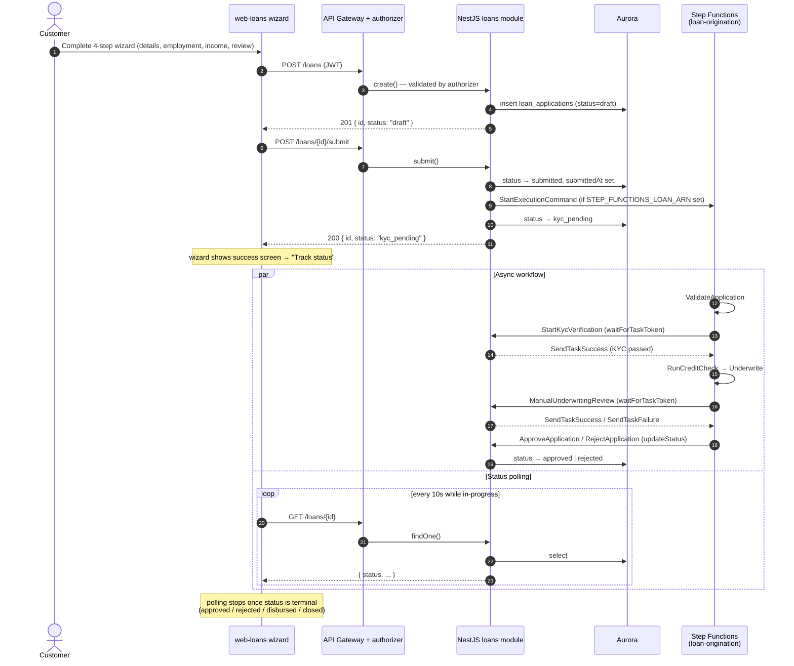
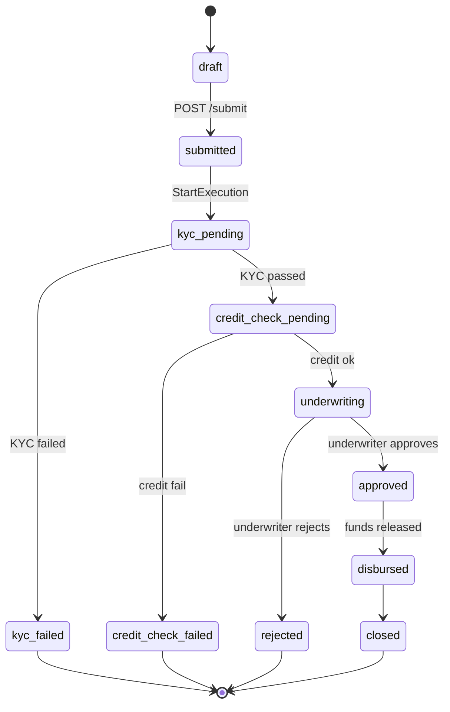

# Loan origination — end-to-end walkthrough

This traces a single loan application from the frontend wizard through the API,
into the Step Functions state machine, and back to the status tracker. It ties
together the loans micro-frontend (`apps/web-loans`), the NestJS `loans` module
(`apps/api/src/loans`), and the `loan-origination` state machine
(`workflows/step-functions/loan-origination.asl.json`).

## Sequence

## Step-by-step

### 1. The wizard (`apps/web-loans`)

`LoanApplicationWizard` collects input across four Zustand-backed steps — loan
details, employment, income, and a review screen with an amortization-based
monthly-payment estimate. On submit, `Step4Review` calls two hooks in sequence:

1. `useCreateLoan()` → `POST /loans` — creates the application as `draft`.
2. `useSubmitLoan()` → `POST /loans/{id}/submit` — transitions it and kicks off the workflow.

### 2. Create + submit (`apps/api/src/loans/loans.service.ts`)

- `create(userId, dto)` inserts a `loan_applications` row with `status: 'draft'`.
- `submit(id, userId)` enforces that only a `draft` may be submitted, sets `status = 'submitted'` and `submittedAt`, then — **only if `STEP_FUNCTIONS_LOAN_ARN` is set** — issues a `StartExecutionCommand` and advances `status` to `kyc_pending`. Locally, with the ARN unset, the application simply stays `submitted`, so the flow is demoable without AWS.

### 3. The state machine (`workflows/step-functions/loan-origination.asl.json`)

`ValidateApplication → StartKycVerification → RunCreditCheck → Underwrite →
ManualUnderwritingReview → ApproveApplication | RejectApplication`.

The human/async steps (`StartKycVerification`, `ManualUnderwritingReview`) use
the **`waitForTaskToken`** integration pattern: Step Functions pauses and hands
a task token to the NestJS Lambda, which persists it and later resumes the
execution with `SendTaskSuccessCommand` (advance) or `SendTaskFailureCommand`
(reject). Terminal transitions call back into `LoansService.updateStatus()` to
write `approved` / `rejected` to Aurora. See
`workflows/step-functions/README.md` for the full state diagram, retries, and
timeouts.

### 4. Status tracking (`apps/web-loans`)

Clicking **Track status** renders `LoanStatusPanel`, which uses `useLoan(id)`.
React Query's `refetchInterval` returns `10_000` while the status is in-progress
(`submitted`, `kyc_pending`, `credit_check_*`, `underwriting`) and `false` once
it reaches a terminal state (`approved`, `rejected`, `disbursed`, `closed`) — so
the UI live-updates through the workflow and then stops polling automatically.

## Loan status lifecycle

## Observing a run

- **Step Functions**: AWS Console → Step Functions → `ally-demo-<env>-loan-origination` → the execution's visual graph and event history show each state and any task-token waits.
- **Logs / correlation**: grab the `x-correlation-id` header from any wizard response, then run the **`ally-demo-<env>/trace-by-correlation-id`** Logs Insights saved query (replace the placeholder) to see the full request timeline across the API and authorizer.
- **Locally**: with `STEP_FUNCTIONS_LOAN_ARN` unset, submit a loan and watch it stay `submitted`; to exercise later states, call `LoansService.updateStatus` (or the admin review endpoint `POST /admin/loans/{id}/review`) to move it to `approved` / `rejected`.
