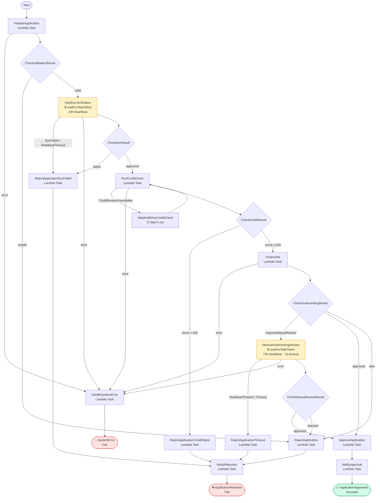
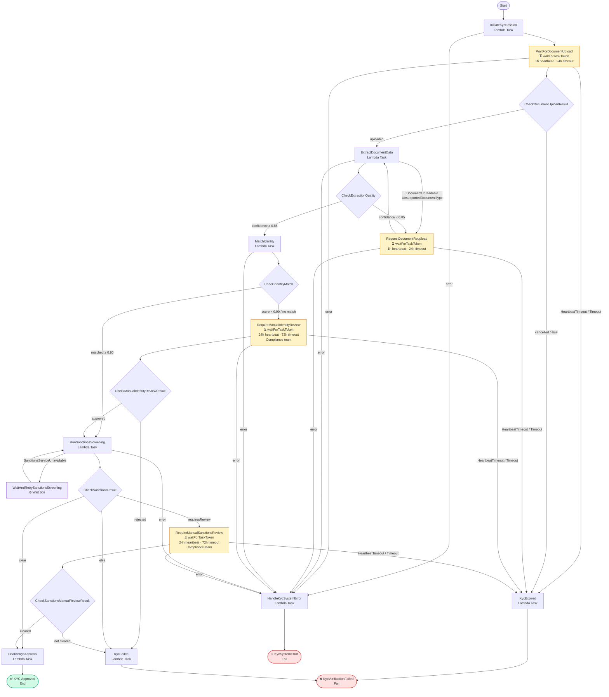

# Step Functions State Machines

## Files

| File | Description |
|---|---|
| `loan-origination.asl.json` | End-to-end loan origination workflow |
| `kyc-verification.asl.json` | Identity verification sub-workflow (called from loan origination) |

---

## ARN Placeholders

Both ASL files use `${...}` placeholders for Lambda ARNs. These are resolved by Terraform's `templatefile()` function when the `aws_sfn_state_machine` resource is created:

```hcl
# infra/modules/step-functions/main.tf
resource "aws_sfn_state_machine" "loan_origination" {
  name       = "ally-loan-origination-${var.env}"
  role_arn   = aws_iam_role.step_functions.arn
  definition = templatefile("${path.module}/../../../workflows/step-functions/loan-origination.asl.json", {
    ValidateLoanApplicationFunctionArn  = module.lambda.validate_loan_arn
    StartKycVerificationFunctionArn     = module.lambda.start_kyc_arn
    RunCreditCheckFunctionArn           = module.lambda.credit_check_arn
    UnderwriteFunctionArn               = module.lambda.underwrite_arn
    NotifyUnderwriterFunctionArn        = module.lambda.notify_underwriter_arn
    FinalizeApprovalFunctionArn         = module.lambda.finalize_approval_arn
    FinalizeRejectionFunctionArn        = module.lambda.finalize_rejection_arn
    SendNotificationFunctionArn         = module.lambda.send_notification_arn
    HandleSystemErrorFunctionArn        = module.lambda.handle_system_error_arn
  })
}
```

---

## Loan Origination Flow



### Wait-for-callback states

| State | Waiter | Heartbeat | Timeout |
|---|---|---|---|
| `StartKycVerification` | Customer completes KYC | 24h | — |
| `ManualUnderwritingReview` | Underwriter decision | 72h | 7 days |

---

## KYC Verification Flow



### Wait-for-callback states

| State | Waiter | Heartbeat | Timeout |
|---|---|---|---|
| `WaitForDocumentUpload` | Customer uploads ID document | 1h | 24h |
| `RequestDocumentReupload` | Customer re-uploads after quality failure | 1h | 24h |
| `RequireManualIdentityReview` | Compliance team reviews identity | 24h | 72h |
| `RequireManualSanctionsReview` | Compliance team reviews sanctions hits | 24h | 72h |

---

## How Task Tokens Work

For every `waitForTaskToken` state, the NestJS Lambda:
1. Receives `taskToken` in the event payload from Step Functions.
2. Persists the token (in DynamoDB or the Aurora DB) alongside the relevant record.
3. Returns immediately — Step Functions pauses the execution.
4. When the external event completes (customer uploads a document, underwriter clicks approve), the NestJS handler calls `sfn.sendTaskSuccess({ taskToken, output })` or `sfn.sendTaskFailure({ taskToken, error, cause })` to resume the state machine.

```typescript
// Example: resuming a KYC document upload from an S3 event handler
await sfn.send(new SendTaskSuccessCommand({
  taskToken: storedToken,
  output: JSON.stringify({ status: 'uploaded', s3Key, documentType }),
}));
```

---

## Retry Strategy

All Lambda task states use exponential backoff for transient Lambda errors:

```json
{
  "ErrorEquals": ["Lambda.ServiceException", "Lambda.AWSLambdaException",
                  "Lambda.SdkClientException", "Lambda.TooManyRequestsException"],
  "IntervalSeconds": 2,
  "MaxAttempts": 3,
  "BackoffRate": 2
}
```

External service failures (credit bureau, sanctions API) use a `Wait` state rather than inline retry to avoid exhausting Lambda concurrency during degraded-service windows.
